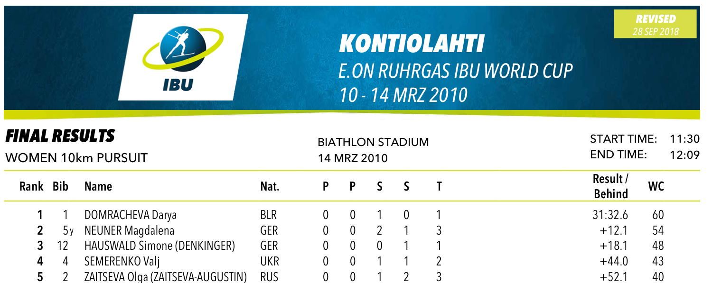
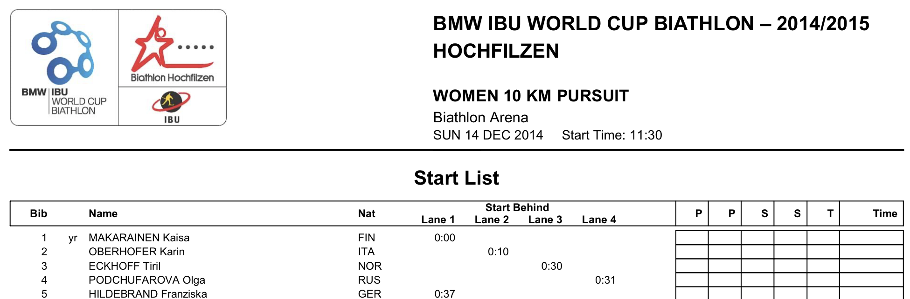
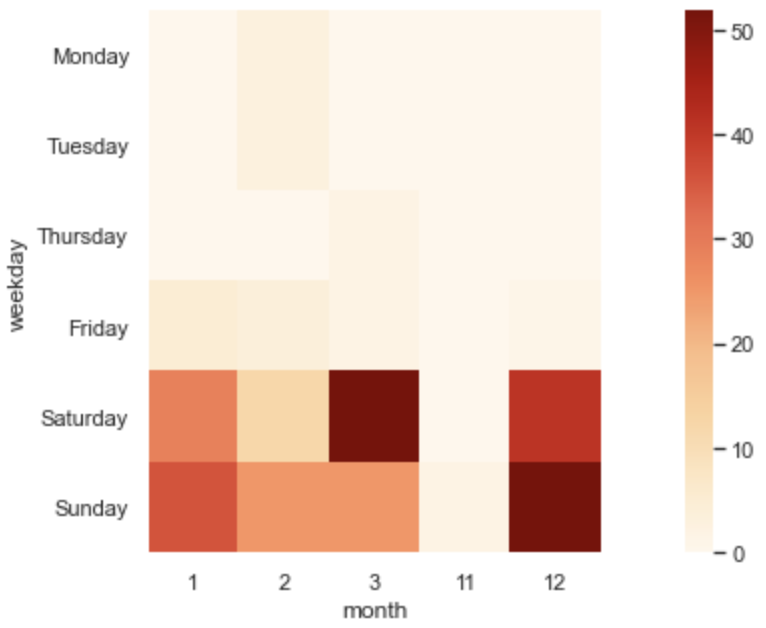
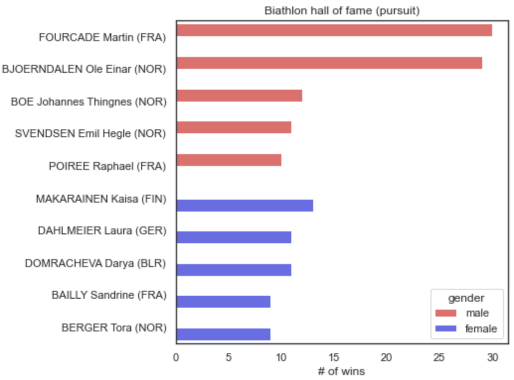
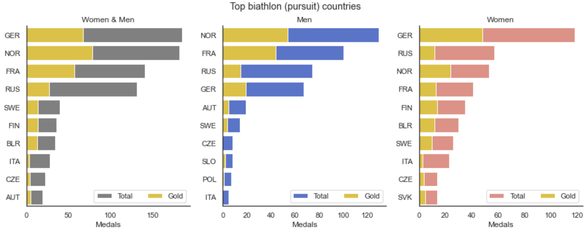
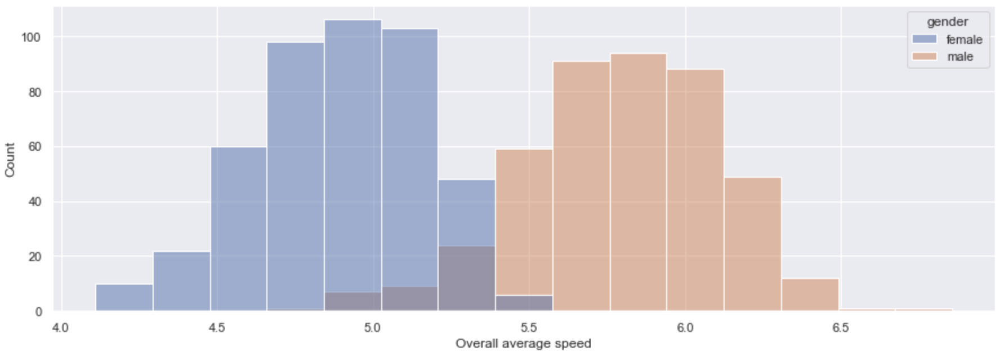
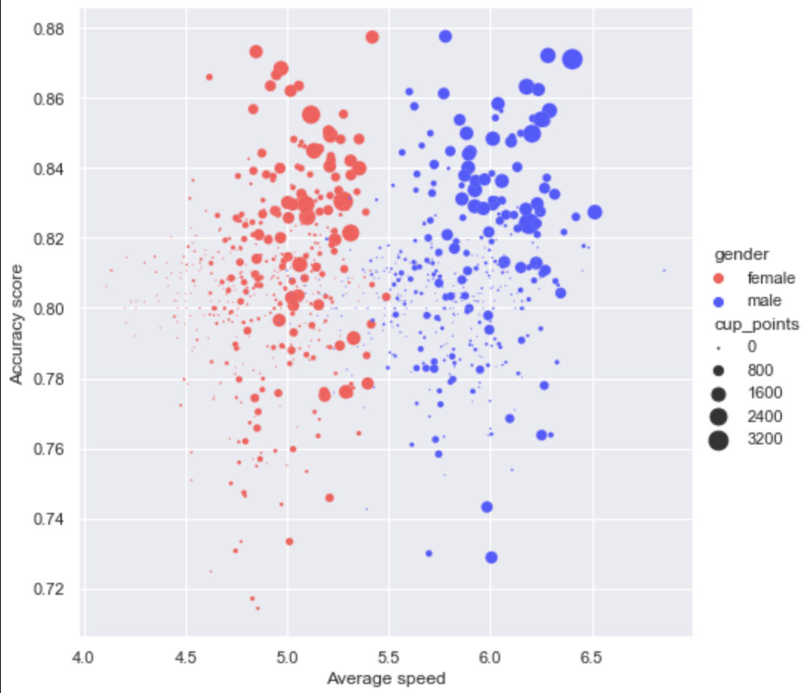

# Biathlon race analysis
Parsing and exploring 2001-2020 biathlon race data from IBU website.
 
## Scope
This project focuses currently on 294 world championship 
pursuit type races that happened during the 2001-2020
period. 
  
## Data parsing
All data used in this project is downloaded from [IBU Datacenter](http://www.biathlonresults.com/)
in .pdf format. Examples:
* race results

* starting list

`data_parser.py` contains all parsing logic: mainly regex, pdfplumber
and pandas. Output is in `pursuit_data_raw.csv`.

## Exploratory data analysis
`EDA.ipynb` contains data exploration and visualisation.
  Insights:
* If you want to watch pursuit races, keep your weekends free:

* These biatheletes are the best at pursuit:

* These countries are the best at pursuit:

* Men on average are considerably faster than women:

* Female biathletes who focus primarily on speed also showed above average results.
Men biathletes on the contrary showed great results only with both good accuracy and good speed.
 